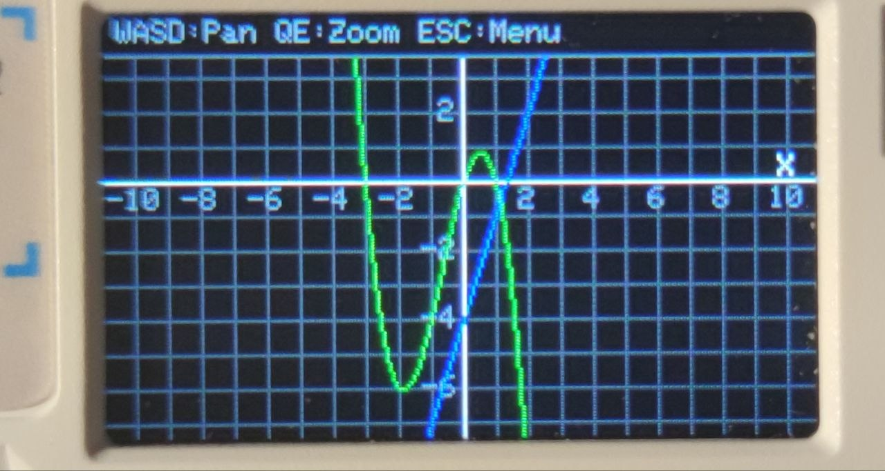

# 📟 xcalc

The Ultimate Pocket Math Engine for **M5Cardputer Adv**

<<<<<<< HEAD
<p align="center">
  
</p>
=======

>>>>>>> a7ff7a761c601fd1b947c55e7cf8013704c62ac7

xcalc is a sophisticated mathematical analysis tool built specifically for the M5Stack Cardputer Adv. Designed with the German school and university curriculum in mind, it transforms your portable ESP32 device into a high-performance computer algebra system (CAS) capable of everything from basic plotting to advanced calculus.

> WARNING: GERMAN LOCALIZATION
> Localized for Germany: While the documentation is in English, the device interface uses standard German mathematical terminology (Kurvendiskussion style).

## ⌨️ Controls


## 🛠 Features (The 13-Function Suite)

xcalc covers 11+ core functions essential for academic success and engineering:
- **f(x) & g(x)** Definition: Support for complex expressions including powers ($x^3$), basic operators, and priority handling.
- **Schnittpunkte** (Intersections): Automatically find where two functions meet or where they cross the axes.
- **Punktprobe**: Instantly check if a specific point $(x, y)$ lies on your graph.
- **Grad & Koeffizienten**: Polynomial expansion and degree analysis.
- **Symmetrie**: Detects even (Achsensymmetrie) or odd (Punktsymmetrie) behavior.
- **Extrempunkte**: Locates local maxima and minima using numerical derivatives.
- **Wendepunkte**: Finds inflection points to understand curvature changes.
- **Krümmungsverhalten**: Analyzes the concavity (convex/concave) of the function.
- **Monotonie**: Defines intervals where the function is increasing or decreasing.
- **Verhalten im Unendlichen**: Calculates limits as $x \to \pm\infty$.
- **Wertetabelle**: Generates a precise table of values with customizable start, end, and step parameters.
- **Graph Zeichnen**: A high-contrast visual plotter optimized for the Cardputer's TFT display.

## 💻 Technical Specs

Built on the PlatformIO ecosystem for maximum stability and performance on the ESP32-S3.

- **Core**: Arduino Framework with Custom Math Engine.
- **Display**: M5Cardputer TFT (ST7789) utilizing high-speed sprite buffering for smooth UI.
- **Input**: Full physical keyboard support via TCA8418.
- **Math**: Custom-built parser for symbolic-to-numeric evaluation and polynomial expansion.

## 🚀 Getting Started
Prerequisites
- VS Code with PlatformIO Extension.
- An M5Stack Cardputer Adv.

1. Installation
Clone the repo:

2. Bash
```
git clone https://github.com/sourcels/xcalc.git
```
Open in **PlatformIO**:
Launch VS Code and open the xcalc folder.

4. Upload:
Connect your Cardputer Adv and hit the PlatformIO: Upload button (the arrow icon in the status bar).


## ⚖️ License
Distributed under the Apache License 2.0. See LICENSE for more information.
